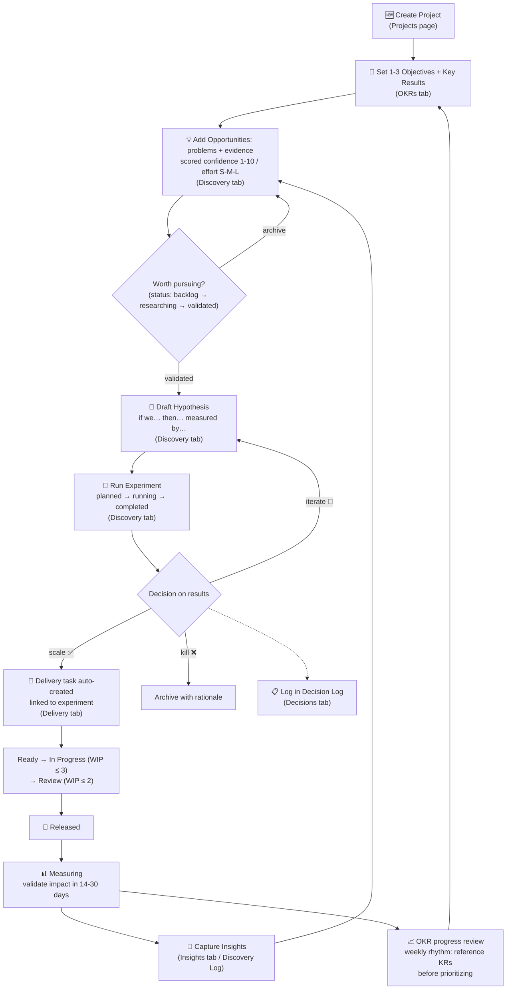

# Project Flow in ProjectFlow

How a project moves through the app, per USER_MANUAL v1.1. Each node names the app tab where it happens.

**The two tracks:** left side of the loop (Opportunities → Hypotheses → Experiments → Insights) is the **Discovery track** — finding the right problems. Right side (Ready → Measuring) is the **Delivery track** — building validated solutions under WIP limits. Decisions and OKRs wrap both.

**Status today (post-Sprint 3):** every step above works in the app except OKR persistence (needs Sprint 4 auth) and the Measuring→metrics feedback (Sprint 5 dashboard).
